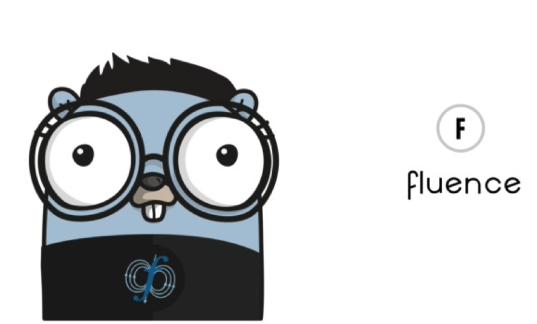

# fluence



A Kubernetes scheduler plugin that places **pod groups** (and individual pods)
by matching them against a [Fluxion](https://github.com/flux-framework/flux-sched)
(flux-sched) resource graph built from the live cluster. 

This is an update from [flux-k8s](https://github.com/flux-framework/flux-k8s)
that uses the native PodGroup and optionally allows for scheduling
against **quantum resources** modeled in the same graph. I am also improving
the design by not requiring a sidecar for fluence - the plugin is built as one
container. 

For quantum resource modeling, we start from the prototype proven out in
[fluxion-quantum](https://github.com/converged-computing/fluxion-quantum). 
This design is an improvement upon the initial fluence because we drop
the `kubernetes-sigs/scheduler-plugins` dependency and use Kubernetes
**native gang scheduling** (the `PodGroup` API, `scheduling.k8s.io/v1alpha2`,
alpha in 1.35/1.36).

## How it works

Gang semantics (all-or-nothing) come from the native `PodGroup` API. Fluence is
responsible only for **placement**:

1. **Discover** — on startup fluence lists cluster nodes and turns their
   cpu/memory/gpu capacity into a Fluxion JGF resource graph
   (`pkg/cluster` + `pkg/jgf`). Quantum backends from a config file are injected
   as `qpu` vertices under a `qgateway` (`AddQuantum`).
2. **Match** — when the first pod of a group hits `PreFilter`, fluence builds a
   Fluxion jobspec for the whole gang (`pkg/fluence.JobspecForGroup`), asks the
   matcher to allocate (`pkg/graph.FluxionGraph.MatchAllocateSpec`), and parses
   the allocation into node names (`PlacementFromAllocation`).
3. **Place** — `Filter` then permits each pod only on its allocated node.

For a **quantum** pod (one that requests `quantum.flux-framework.org/qpu`), the
match allocates a `qpu` vertex instead of cores; the allocated backend name
(e.g. `ibm_fez`) is what the workload submits to via
[qrmi-go](https://github.com/converged-computing/qrmi-go) (job mode on the IBM
open plan — see fluxion-quantum for that story).

```
nodes (kubectl get nodes) ─┐
                           ├─► JGF resource graph ─► Fluxion match ─► node + backend placement
quantum-backends.yaml ─────┘
```

## Build

The scheduler binary links flux-sched (the matcher) and, for quantum, QRMI:

```bash
# If you want to debug inside the .devcontainer, use this one
make build      # needs flux-sched at /opt/flux-sched and QRMI at /usr/local

# If you want to test outside (and build the docker image, this one)
make image
```

Pure-Go pieces (graph builder, discovery, jobspec, placement) need neither and
are covered by:

```bash
make test
```

## Deploy

Here is how I am creating a development cluster with a release of Kubernetes that will support
what we need:

```bash
kind create cluster --image kindest/node:v1.36.1 --config deploy/kind-config.yaml
```

And if you [need to install kind](https://kind.sigs.k8s.io/docs/user/quick-start#installing-from-release-binaries).


```bash
# This creates the quantum backends yaml graph
kubectl create configmap fluence-quantum-backends --from-file=quantum-backends.yaml=config/quantum-backends.yaml -n kube-system

# load docker image
kind load docker-image ghcr.io/converged-computing/fluence

kubectl apply -f deploy/fluence.yaml          # RBAC + scheduler in kube-system
kubectl apply -f examples/podgroup.yaml       # a gang scheduled by fluence
```

This works by enabling the native gang feature on the cluster (kube-scheduler / API server), meaning
the `GangScheduling` and `GenericWorkload` feature gates and the `scheduling.k8s.io/v1alpha2` API group.
In the future these will likely be enabled by default.

Pods opt in with `schedulerName: fluence` and a `scheduling.k8s.io/pod-group` label; group size can be set explicitly with
`fluence.flux-framework.org/group-size`.

Note that when you are developing / debugging a group deletion can hang because of finalizers. I do:

```bash
kubectl patch podgroup training -n default --type=merge -p '{"metadata":{"finalizers":null}}'
```

## Quantum

We can bing fluence up with quantum resources by pointing `FLUENCE_QUANTUM_CONFIG` at a backends file (see `config/quantum-backends.yaml`). 
Those backends become schedulable `qpu` vertices; a pod requesting `quantum.flux-framework.org/qpu` will be matched to one, and the allocated backend is handed to the workload.

**under development** I am still thinking about how to make this request. -V

## License

HPCIC DevTools is distributed under the terms of the MIT license.
All new contributions must be made under this license.

See [LICENSE](https://github.com/converged-computing/cloud-select/blob/main/LICENSE),
[COPYRIGHT](https://github.com/converged-computing/cloud-select/blob/main/COPYRIGHT), and
[NOTICE](https://github.com/converged-computing/cloud-select/blob/main/NOTICE) for details.

SPDX-License-Identifier: (MIT)

LLNL-CODE- 842614
